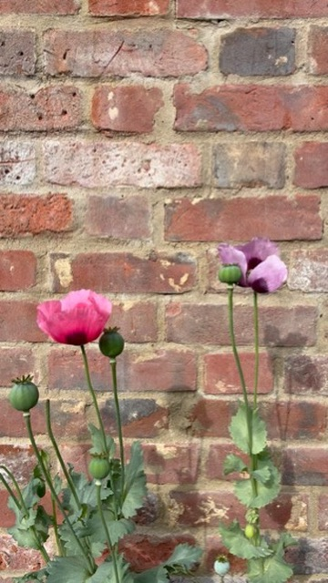

# i know you're not boring

A browser-based creative coding tool that re-renders video and images through swappable visual filters. Drop in a file, dial in the look, export a frame or record a clip.



---

## Getting started

```bash
npm install
npm run dev
```

Open [http://localhost:5173](http://localhost:5173), drop a video or image onto the canvas area, and start tweaking.

> **Tip:** Drag from your desktop or Downloads folder, not directly from the macOS Photos app — Photos hands the browser a virtual reference rather than the actual file.

---

## Filters

### ASCII (live now)

Samples each frame onto a character grid and maps brightness to a glyph ramp. Each character is tinted with the source pixel's colour for a coloured-ASCII effect.

| Control | What it does |
|---|---|
| **Glyph colour** | `source-pixel` tints each character with the original colour · `fixed-ink` uses a single ink colour |
| **Ink colour** | Colour used in fixed-ink mode |
| **Background** | `flat` solid fill · `cell-glow` floods each cell with its source colour for a neon bleed effect |
| **Glow intensity** | Opacity of the cell-glow layer (0 – 1) |
| **Cell size** | Width of each character cell in pixels — drag left for dense, right for chunky |
| **Cell height** | Vertical stretch multiplier · `2.0` matches typical monospace proportions |
| **Font scale** | Glyph size relative to the cell — above `1.0` characters overlap |
| **Contrast** | Boosts or compresses the brightness range before mapping to the ramp |
| **Invert** | Flips the ramp so bright areas get sparse glyphs and dark areas get dense |
| **Glyph ramp** | `standard` full ASCII density ramp · `blocks` Unicode block elements · `dots` dot progression |
| **Background colour** | Base fill colour drawn before everything else |

---

## Export

| Button | Output |
|---|---|
| **Save PNG** | Grabs the current canvas frame as a `.png` |
| **Record → Stop** | Records the canvas to `.webm` using `MediaRecorder` on `canvas.captureStream()` |

---

## Session history

Each file you load generates a thumbnail in the right-hand rail (~1 second after load). Click any thumbnail to restore that source. New thumbnails only appear when you load a fresh file — restoring from history doesn't duplicate the entry.

---

## Architecture

```
source (video | image)
  └── RenderPipeline (RAF loop)
        └── frameSampler    → PixelGrid (one getImageData call per frame)
              └── Filter.render(ctx, grid, params)
                    └── canvas output  ←  captureStream → MediaRecorder
```

- **Vite + vanilla TypeScript** — no framework, tight render loop
- **Filter interface** — each filter exports `{ id, label, controls, render }`. Adding a new filter is dropping in a file and registering it.
- **Canvas 2D** for ASCII / pixel / dots / lines filters
- **WebGL** (raw shaders or `regl`) planned for shader-based effects

---

## Development

```bash
npm run dev       # dev server with HMR
npm test          # run unit tests (Vitest)
npm run test:watch
npm run build     # type-check + production bundle
```

Tests cover the pipeline core — frame sampler and ASCII brightness/glyph logic. The filter `render()` functions are tested visually in the browser.

---

## Planned filters

- Emoji
- Pixel (chunky downsampled blocks)
- Dots (halftone / stippling)
- Lines (flow-field or scanline strokes)
- WebGL shaders (chromatic aberration, posterize, threshold, glitch)
